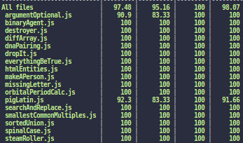

# Freecodecamp-Basic-Algo

This repo is based on my Practise on Algorithm on freecodecamp

#### Completed the algorithms for

- sum all
- argument optional
- destroyer
- binary agent
- diff Array
- Dna pairing
- drop it
- everything be true
- html entities
- make a person
- missing letters
- orbital period calculation
- pig latin
- search and replace
- smallest common multiples
- sorted union
- spinal case
- steam roller
- sum all odd fibonanci
- sum all prime
- where art thou

with a good test cases and coverage

